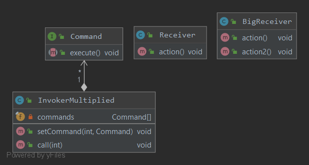

### Команда
Инкапсулирует запрос в виде объекта, делая возможной параметризацию клиентских объектов с другими запросами, организацию очереди или регистрацию запросов, а также поддержку отмены операций.
#### Пример реализации паттерна

Или

Если использовать лямбда-выражения, число классов конкретных комманд заметно уменьшается (в моем случае их вообще нет)
