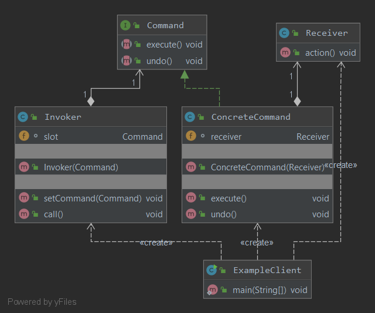
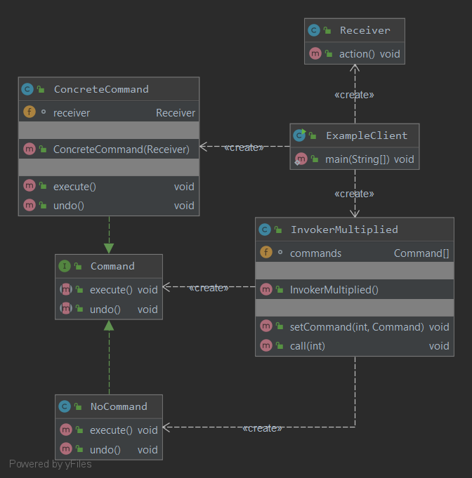

### Команда
Инкапсулирует запрос в виде объекта, делая возможной параметризацию клиентских объектов с другими запросами, организацию очереди или регистрацию запросов, а также поддержку отмены операций.
TODO: запилить очереди запросов и реристрацию запросов
#### Пример реализации паттерна:

Или
