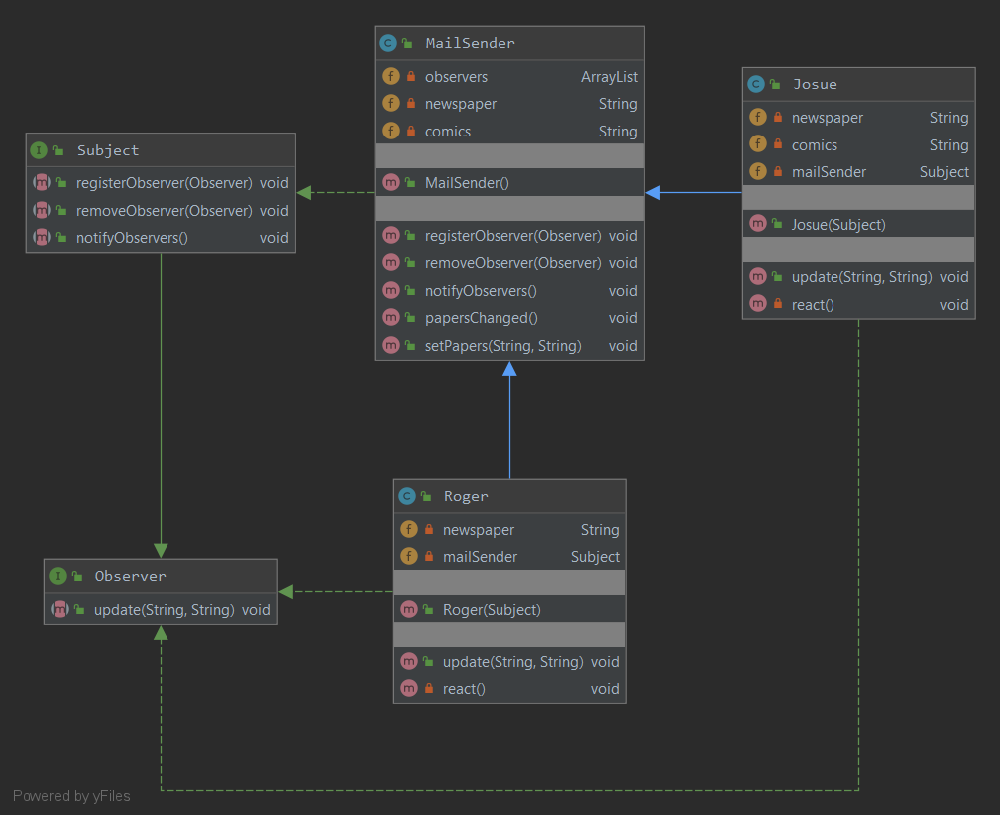
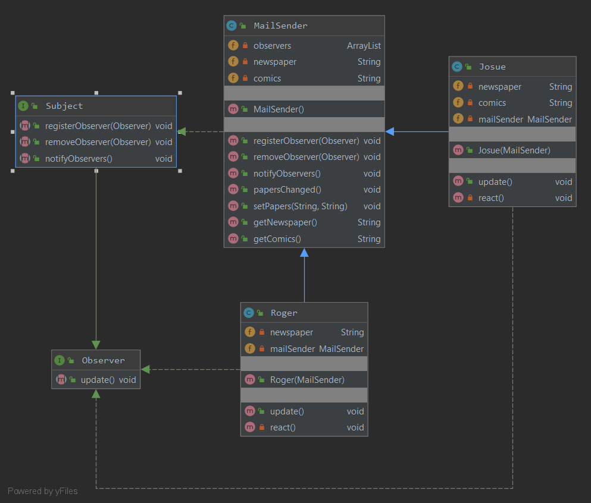
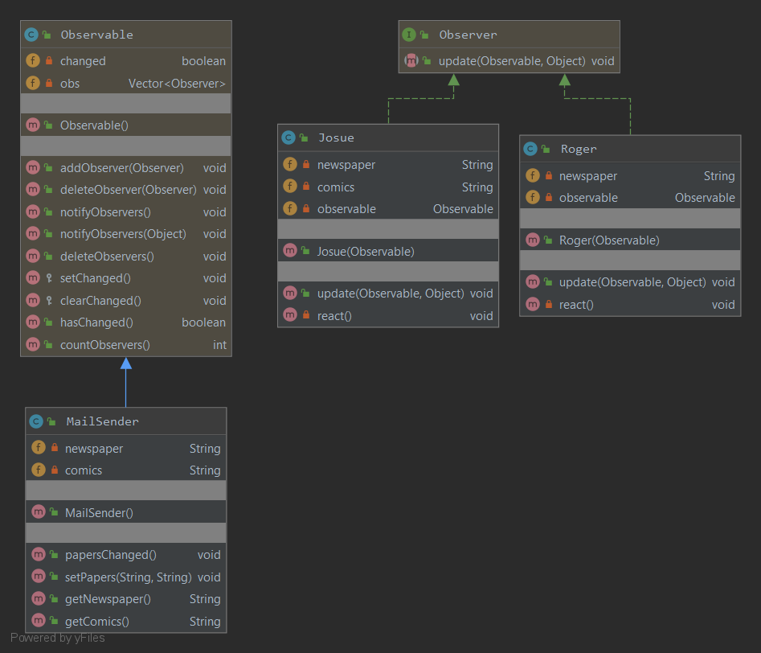

### Наблюдатель
Паттерн определяет отношение "один-ко-многим" между объектами таким образом, что при изменении состояния одного объекта происходит автоматическое оповещение и обновление всех зависимых объектов. 
Объект с состоянием называется **субъектом**, а зависимые объекты - **наблюдателями**.
#### Пример реализации паттерна:
С передачей объекта данных

Модель запроса данных (без передачи объекта)

С использованием пакета `java.util`
