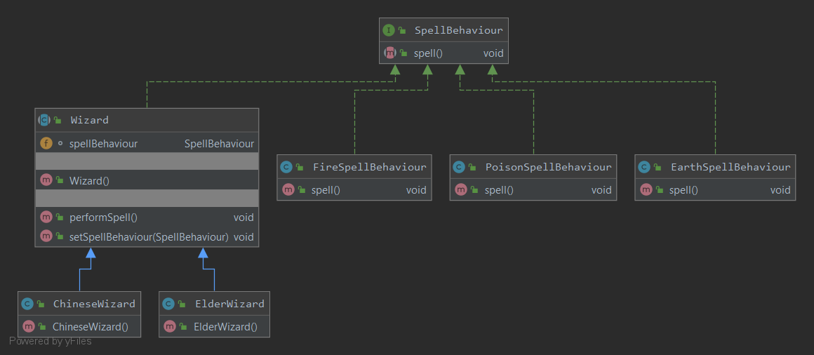

### Стратегия
Паттерн определяет семейство алгоритмов, инкапсулирует каждый из них и обеспечивает их взаимозаменяемость. Он позволяет модифицировать алгоритмы независимо от их использования на стороне клиента.
####Пример реализации паттерна:

