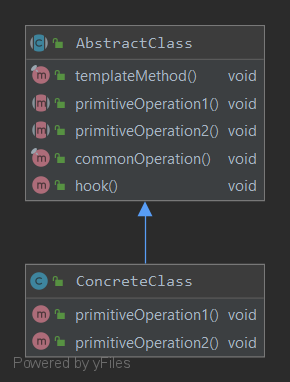

### Шаблонный метод
Задает "скелет" алгоритма в методе, оставляя определение реализации некоторых шагов субклассам. Субклассы могут переопределять некоторые части алгоритма без изменения его структуры.
#### Пример реализации паттерна
