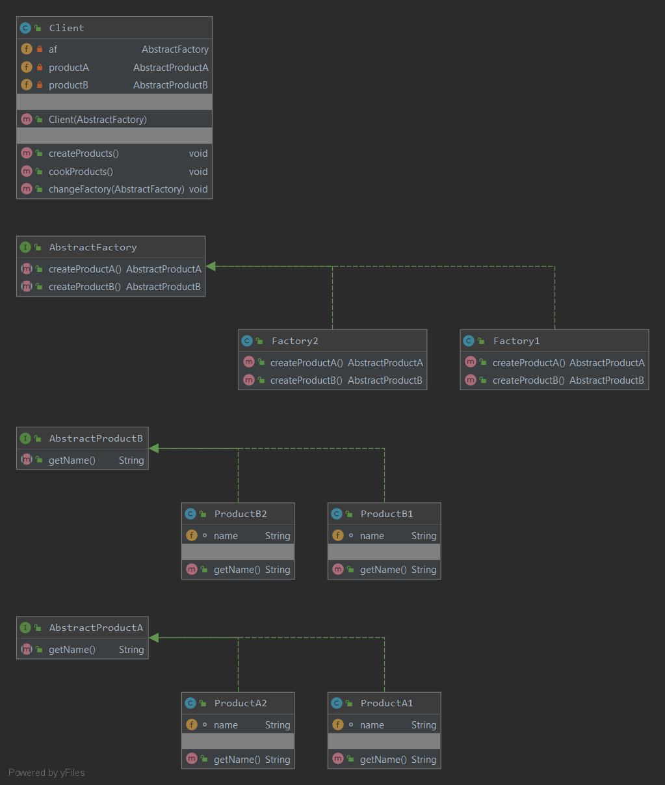

### Абстрактная фабрика
Паттерн предоставляет интерфейс создания семейств взаимосвязанных или взаимозависимых объектов без указания их конкретных классов.
#### Пример реализации паттерна:
Стрелочки дорисуйте сами.
