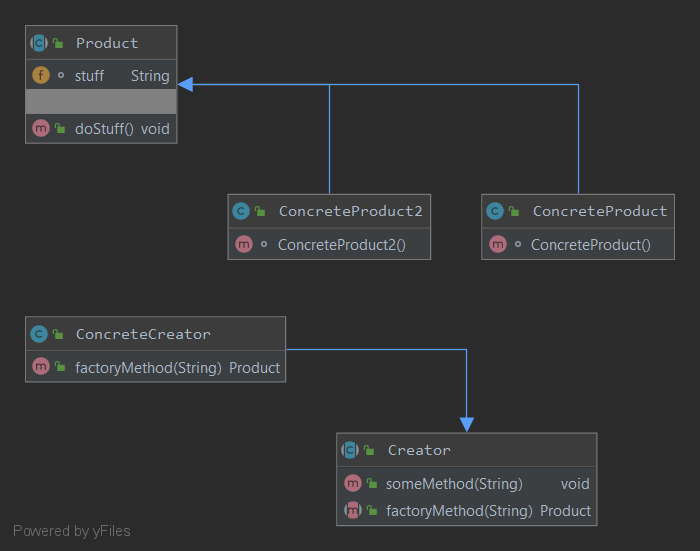

### Фабричный метод
Паттерн определяет интерфейс создания объекта, но позволяет субклассам выбрать класс создаваемого экземпляра. Таким образом, **фабричный метод** делегирует операцию создания экземпляра субклассам.
#### Пример реализации паттерна
