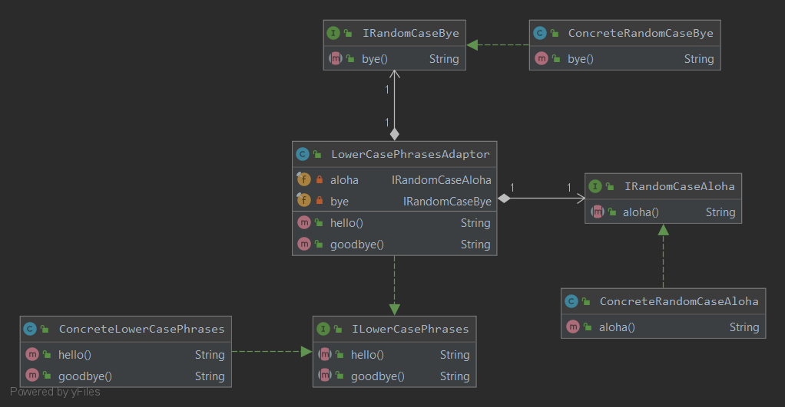

### Адаптер
Преобразует интерфейс класса к другому интерфейсу, на который рассчитан клиент. Адаптер обеспечивает совместную работу классов, невозможную в обычных условиях из-за несовместимости интерфейсов.
#### Пример реализации паттерна

Адаптер может содержать в себе несколько различных первичных классов, а не один.
#### Например, вот так
