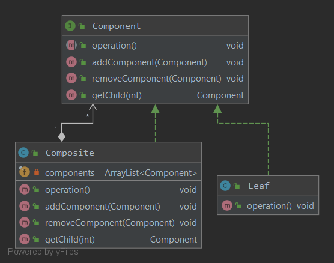
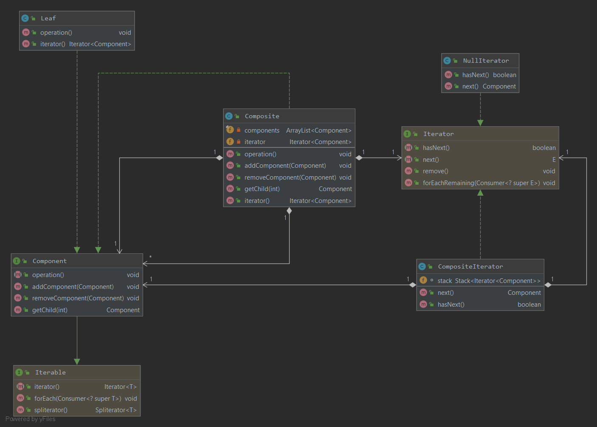

### Компоновщик
Объединяет объекты в древовидные структуры для представления иерархий "часть/целое".\
Компоновщик позволяет выполнять однородные операции с отдельными объектами и их совокупностями.
#### Пример реализации паттерна

Для этого паттерна можно удобно применять реализованную по-своему версию итератора
