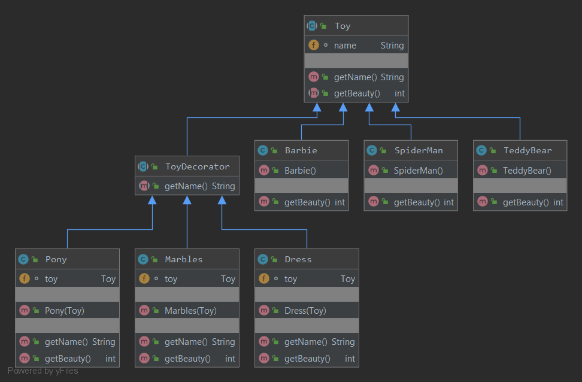

### Декоратор
Паттерн динамически наделяет объект новыми возможностями и является гибкой альтернативой субклассированию в области расширения функциональности. Удовлетворяет принципу открытости\закрытости.
Этот паттерн используется, например, для классов ввода/вывода в пакете `java.io`
Рекомендуется применять совместно с фабрикой/строителем.
#### Пример реализации паттерна:

#### Пример реализации паттерна в `java.io`:

`FilterInputStream` - абстрактный декоратор