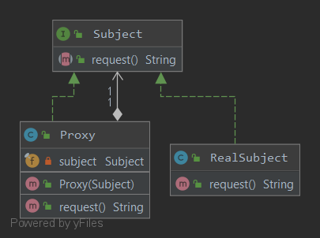

### Заместитель
Предоставляет суррогатный объект, управляющий доступом к другому объекту.
* Удалённый заместитель управляет доступом к удалённому объекту
* Виртуальный заместитель управляет доступом к ресурсу, создание которого требует больших затрат ресурсов
* Защитный заместитель контролирует доступ к ресурсу в соответствии с системой привилегий\
* А так же кэширующий, синхронизирующий, фильтрующий, упрощающий, заместитель отложенного копирования, умная ссылка
#### А как какать?
RMI из стандартной библиотеки java.rmi.*\
Динамический Proxy из стандартной библиотеки java.lang.reflect
#### Пример реализации паттерна
Обобщенно он выглядит вот так\
